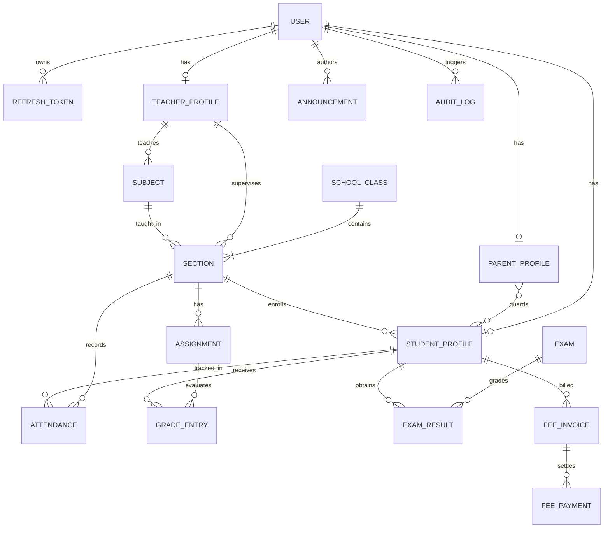

# Database Design & Data Modeling Specification
## School Management & Information Platform (PostgreSQL + Prisma ORM)

> **Production Database Specification**: See comprehensive PostgreSQL & Prisma schema documentation in [`docs/DATABASE-ARCHITECTURE.md`](./DATABASE-ARCHITECTURE.md).

## 1. Entity Relationship Diagram (ERD)



---

## 2. Core Collections & Schema Specifications

### 2.1 Collection: `users`
Stores system-wide authentication credentials, global roles, and basic profile identities.

```typescript
interface IUser {
  _id: ObjectId;
  firstName: string;
  lastName: string;
  email: string;                  // unique, lowercase, indexed
  passwordHash: string;           // bcrypt (salt factor 10)
  role: 'SUPER_ADMIN' | 'ADMIN' | 'TEACHER' | 'STUDENT' | 'PARENT';
  avatarUrl?: string;
  phone?: string;
  isActive: boolean;              // default: true
  refreshTokens: string[];        // for token rotation
  lastLoginAt?: Date;
  createdAt: Date;
  updatedAt: Date;
}
```
**Indexes**:
- `{ email: 1 }` (unique)
- `{ role: 1 }`

---

### 2.2 Collection: `students`
Extended demographic, academic status, and familial links for enrolled students.

```typescript
interface IStudentProfile {
  _id: ObjectId;
  userId: ObjectId;               // ref: 'users' (unique)
  studentIdNumber: string;        // unique, e.g. "OAK-882190"
  dateOfBirth: Date;
  gender: 'MALE' | 'FEMALE' | 'NON_BINARY' | 'UNDISCLOSED';
  bloodGroup?: string;
  emergencyContact: {
    name: string;
    relationship: string;
    phone: string;
  };
  currentGradeLevel: string;      // e.g. 'GRADE_11'
  sectionId: ObjectId;            // ref: 'sections'
  parentIds: ObjectId[];          // ref: 'parents'
  medicalNotes?: string;
  enrollmentDate: Date;
  status: 'ACTIVE' | 'ALUMNI' | 'SUSPENDED' | 'TRANSFERRED';
}
```
**Indexes**:
- `{ userId: 1 }` (unique)
- `{ studentIdNumber: 1 }` (unique)
- `{ sectionId: 1 }`
- `{ parentIds: 1 }`

---

### 2.3 Collection: `parents`
Stores guardian identification, occupations, and child linkages.

```typescript
interface IParentProfile {
  _id: ObjectId;
  userId: ObjectId;               // ref: 'users' (unique)
  occupation?: string;
  residentialAddress: string;
  secondaryPhone?: string;
  studentIds: ObjectId[];         // ref: 'students'
  preferredLanguage: string;      // default: 'English'
}
```
**Indexes**:
- `{ userId: 1 }` (unique)
- `{ studentIds: 1 }`

---

### 2.4 Collection: `teachers`
Stores faculty qualifications, department affiliations, and academic appointments.

```typescript
interface ITeacherProfile {
  _id: ObjectId;
  userId: ObjectId;               // ref: 'users' (unique)
  employeeIdNumber: string;       // unique, e.g. "FAC-104"
  department: string;             // e.g. 'Natural Sciences'
  designation: string;            // e.g. 'Senior Physics Lecturer'
  qualifications: string[];       // e.g. ['B.Sc Physics', 'Ph.D. Education']
  assignedClassIds: ObjectId[];   // ref: 'sections'
  hireDate: Date;
}
```
**Indexes**:
- `{ userId: 1 }` (unique)
- `{ employeeIdNumber: 1 }` (unique)
- `{ department: 1 }`

---

### 2.5 Academic Collections: `classes`, `sections`, `subjects`

#### `classes`
```typescript
interface ISchoolClass {
  _id: ObjectId;
  name: string;                   // e.g. "Grade 11"
  code: string;                   // unique, e.g. "GR11"
  academicStage: 'PRIMARY' | 'MIDDLE' | 'HIGH';
  academicYear: string;           // e.g. "2026-2027"
}
```

#### `sections`
```typescript
interface ISection {
  _id: ObjectId;
  classId: ObjectId;              // ref: 'classes'
  name: string;                   // e.g. "Section A"
  roomNumber: string;             // e.g. "Lab 304"
  capacity: number;               // default: 30
  homeroomTeacherId: ObjectId;    // ref: 'teachers'
}
```

#### `subjects`
```typescript
interface ISubject {
  _id: ObjectId;
  name: string;                   // e.g. "AP Physics C: Mechanics"
  code: string;                   // unique, e.g. "PHY-401"
  credits: number;                // e.g. 1.0
  department: string;
  classId: ObjectId;              // ref: 'classes'
  teacherId: ObjectId;            // ref: 'teachers'
}
```

---

### 2.6 Collection: `attendance`
Stores daily attendance records with compound uniqueness.

```typescript
interface IAttendance {
  _id: ObjectId;
  sectionId: ObjectId;            // ref: 'sections'
  studentId: ObjectId;            // ref: 'users'
  date: string;                   // ISO Date YYYY-MM-DD
  status: 'PRESENT' | 'ABSENT' | 'LATE' | 'EXCUSED';
  period?: number;                // null for whole-day homeroom
  markedByTeacherId: ObjectId;    // ref: 'users'
  notes?: string;
  createdAt: Date;
}
```
**Indexes**:
- `{ sectionId: 1, studentId: 1, date: 1 }` (unique compound index)
- `{ studentId: 1, date: -1 }`
- `{ date: 1 }`

---

### 2.7 Collection: `assignments` & `grade_entries`
Stores coursework, homework, submissions, and teacher evaluations.

```typescript
interface IAssignment {
  _id: ObjectId;
  sectionId: ObjectId;            // ref: 'sections'
  subjectId: ObjectId;            // ref: 'subjects'
  teacherId: ObjectId;            // ref: 'users'
  title: string;
  description: string;
  dueDate: Date;
  maxPoints: number;              // default: 100
  weightPercentage: number;       // default: 10
  attachmentUrls?: string[];
  entries: {
    studentId: ObjectId;          // ref: 'users'
    submissionUrl?: string;
    submittedAt?: Date;
    pointsEarned?: number;
    letterGrade?: string;         // 'A', 'B', etc.
    feedback?: string;
    status: 'PENDING' | 'SUBMITTED' | 'GRADED' | 'LATE';
  }[];
  createdAt: Date;
}
```
**Indexes**:
- `{ sectionId: 1, dueDate: -1 }`
- `{ 'entries.studentId': 1 }`

---

### 2.8 Collection: `admissions`
Manages the online admissions pipeline from submission through decision.

```typescript
interface IAdmissionApplication {
  _id: ObjectId;
  applicationNumber: string;      // unique, e.g. "ADM-2026-1042"
  studentFirstName: string;
  studentLastName: string;
  dateOfBirth: string;
  gradeApplyingFor: string;
  parentName: string;
  parentEmail: string;
  parentPhone: string;
  address: string;
  previousSchool?: string;
  status: 'SUBMITTED' | 'UNDER_REVIEW' | 'INTERVIEW_SCHEDULED' | 'ACCEPTED' | 'WAITLISTED' | 'REJECTED';
  interviewDate?: Date;
  decisionNotes?: string;
  assignedReviewerId?: ObjectId;  // ref: 'users'
  submittedAt: Date;
  updatedAt: Date;
}
```
**Indexes**:
- `{ applicationNumber: 1 }` (unique)
- `{ status: 1 }`
- `{ parentEmail: 1 }`

---

### 2.9 Collection: `announcements`
Stores public, internal, and role-targeted notices and circulars.

```typescript
interface IAnnouncement {
  _id: ObjectId;
  title: string;
  content: string;
  category: 'ACADEMIC' | 'SPORTS' | 'EVENT' | 'URGENT' | 'GENERAL';
  isPinned: boolean;
  authorId: ObjectId;             // ref: 'users'
  authorName: string;
  targetRoles: ('ADMIN' | 'TEACHER' | 'STUDENT' | 'PARENT')[];
  attachmentUrls?: string[];
  publishDate: Date;
  expiresAt?: Date;
  createdAt: Date;
}
```
**Indexes**:
- `{ isPinned: -1, publishDate: -1 }`
- `{ category: 1 }`
- `{ targetRoles: 1 }`

---

### 2.10 Collection: `fees` & `payments`
Tracks tuition schedules, invoicing, receipts, and balance ledgers.

```typescript
interface IFeeInvoice {
  _id: ObjectId;
  studentId: ObjectId;            // ref: 'students'
  invoiceNumber: string;          // unique, e.g. "INV-2026-0042"
  title: string;                  // e.g. "Fall 2026 Tuition Installment"
  academicTerm: string;
  totalAmount: number;
  paidAmount: number;
  dueDate: Date;
  status: 'PENDING' | 'PARTIAL' | 'PAID' | 'OVERDUE';
  payments: {
    transactionId: string;
    amountPaid: number;
    paymentMethod: 'ONLINE_CARD' | 'BANK_TRANSFER' | 'CHEQUE';
    paidAt: Date;
    receiptUrl?: string;
  }[];
}
```
**Indexes**:
- `{ invoiceNumber: 1 }` (unique)
- `{ studentId: 1, status: 1 }`
- `{ dueDate: 1 }`

---

### 2.11 Collection: `audit_logs`
Immutable record of security and administrative operations.

```typescript
interface IAuditLog {
  _id: ObjectId;
  actorId: ObjectId;              // ref: 'users'
  actorEmail: string;
  actorRole: string;
  action: string;                 // e.g. "UPDATE_ADMISSION_STATUS", "SUBMIT_GRADE"
  targetEntity: string;           // e.g. "admissions", "grades"
  targetId: string;
  ipAddress: string;
  userAgent: string;
  changesDiff?: Record<string, any>;
  timestamp: Date;                // capped collection or TTL 365 days
}
```
**Indexes**:
- `{ timestamp: -1 }`
- `{ actorId: 1 }`
- `{ action: 1 }`
- `{ targetEntity: 1, targetId: 1 }`
